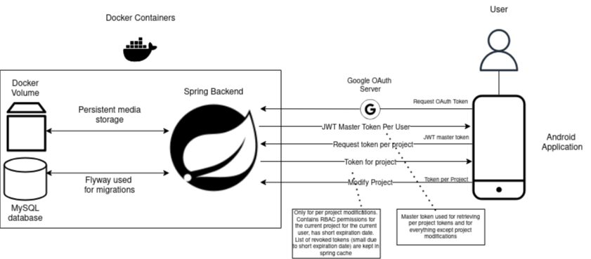

# Bugtracker Backend
# About
Backend for [android app](https://github.com/d-najd/Bugtracker-2.0-App) used for project management and issue tracking

# Architecture


* Some features are not fully implemented yet (like media storage) but I plan this to be the final architecture.

# Used technologies

* Spring boot
  * Flyway
  * JPA
  * JPA Entity Graph
  * ShapeShift (entity mapping)
* Spring Security
  * OAuth 
  * JWT
* Docker 
  * Docker Compose
  * Docker Volumes
* MySQL
* Kotlin

# Setup

1. Git clone the project

```shell
git clone https://github.com/d-najd/portfolio.git
```

2. Install [docker compose](https://docs.docker.com/compose/install/)
3. Run [docker-compose.yml](docker-compose.yml) in root directory
